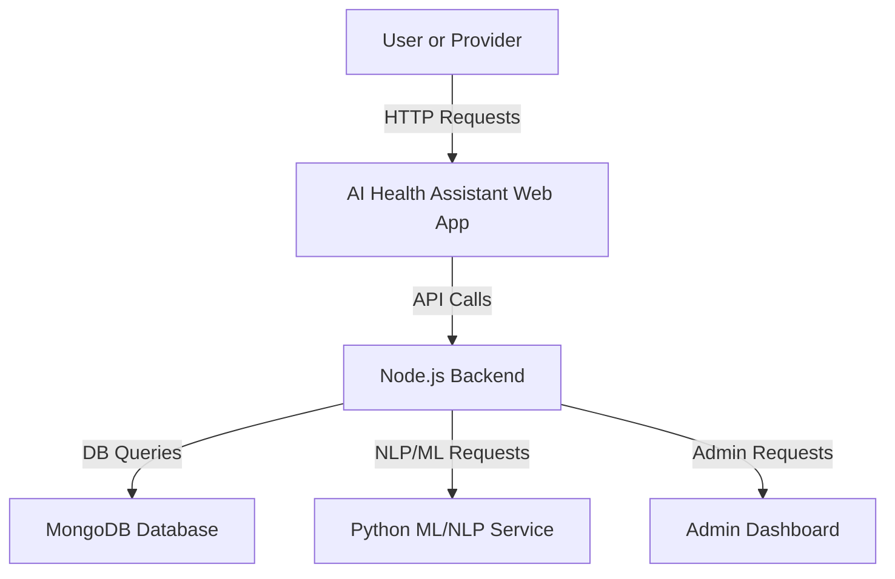

# AI Health Assistant

AI Health Assistant is an intelligent platform designed to help users manage health-related information, interact with healthcare services, and receive personalized recommendations. This repository combines machine learning, natural language processing, and modern web technologies to offer an accessible health assistant for both users and providers.

## Introduction

AI Health Assistant aims to bridge the gap between users and healthcare information through conversational interfaces and smart analytics. The application integrates multiple components, including user authentication, chat-based interactions, and a backend infrastructure to support data storage and processing. It is suitable for those looking to deploy a virtual health assistant or develop new AI-driven health solutions.

## Features

- **User Authentication**: Secure registration and login for users and healthcare providers.
- **Chat-Based Health Assistant**: Interactive chat interface powered by AI for answering health queries.
- **Appointment Scheduling**: Book and manage appointments with healthcare professionals.
- **Medical Record Management**: Upload and access personal health records securely.
- **Admin Dashboard**: Administrative tools for managing users, appointments, and service analytics.
- **Role-Based Access Control**: Separate views and permissions for patients, doctors, and administrators.
- **Scalable API Architecture**: RESTful API endpoints for seamless integration and expansion.
- **Responsive UI**: Modern web interface optimized for desktop and mobile devices.

## Requirements

- **Node.js** (v14 or above)
- **npm** (v6 or above)
- **MongoDB** (local or cloud instance)
- **Python 3.x** (if using ML/NLP backend features)
- **Git** (for version control)
- **.env** file with required environment variables:
  - Database URLs
  - Secret keys for JWT authentication
  - API keys for external services (if applicable)

## Usage

### 1. Clone the Repository

```bash
git clone https://github.com/amansamani/Ai-health-Assitant-.git
cd Ai-health-Assitant-
```

### 2. Install Dependencies

```bash
npm install
```

If there are Python-based components, navigate to the relevant directory and install dependencies:

```bash
pip install -r requirements.txt
```

### 3. Set Environment Variables

Create a `.env` file in the root directory:

```
MONGO_URI=mongodb://localhost:27017/ai_health_assistant
JWT_SECRET=your_jwt_secret
# Add any other required keys/secrets
```

### 4. Start the Development Server

```bash
npm run dev
```

Or, if using separate backend/frontend:

```bash
npm run server
npm run client
```

### 5. Access the Application

Open your browser and navigate to:

```
http://localhost:3000
```

Log in, create a new user, or access the admin dashboard as needed.

---

## System Architecture

Below is a high-level overview of the system architecture:



---

## Example API Endpoints

### User Registration (POST /api/users/register)

#### Register a New User

```api
{
    "title": "Register New User",
    "description": "Creates a new user account with email and password.",
    "method": "POST",
    "baseUrl": "http://localhost:3000",
    "endpoint": "/api/users/register",
    "headers": [
        {
            "key": "Content-Type",
            "value": "application/json",
            "required": true
        }
    ],
    "bodyType": "json",
    "requestBody": "{\n  \"email\": \"user@example.com\",\n  \"password\": \"password123\"\n}",
    "responses": {
        "201": {
            "description": "User created successfully",
            "body": "{\n  \"message\": \"Registration successful\",\n  \"userId\": \"abc123\"\n}"
        },
        "400": {
            "description": "Validation error",
            "body": "{\n  \"error\": \"Email already exists\"\n}"
        }
    }
}
```

### User Login (POST /api/users/login)

#### Authenticate Existing User

```api
{
    "title": "User Login",
    "description": "Authenticates a user and returns a JWT token.",
    "method": "POST",
    "baseUrl": "http://localhost:3000",
    "endpoint": "/api/users/login",
    "headers": [
        {
            "key": "Content-Type",
            "value": "application/json",
            "required": true
        }
    ],
    "bodyType": "json",
    "requestBody": "{\n  \"email\": \"user@example.com\",\n  \"password\": \"password123\"\n}",
    "responses": {
        "200": {
            "description": "Login successful",
            "body": "{\n  \"token\": \"<jwt_token>\"\n}"
        },
        "401": {
            "description": "Invalid credentials",
            "body": "{\n  \"error\": \"Invalid email or password\"\n}"
        }
    }
}
```

### Chat Assistant (POST /api/assistant/message)

#### Send a Message to Assistant

```api
{
    "title": "Chat Assistant Message",
    "description": "Send a message to the health assistant and receive an AI-powered response.",
    "method": "POST",
    "baseUrl": "http://localhost:3000",
    "endpoint": "/api/assistant/message",
    "headers": [
        {
            "key": "Authorization",
            "value": "Bearer <jwt_token>",
            "required": true
        },
        {
            "key": "Content-Type",
            "value": "application/json",
            "required": true
        }
    ],
    "bodyType": "json",
    "requestBody": "{\n  \"message\": \"What are the symptoms of flu?\"\n}",
    "responses": {
        "200": {
            "description": "Assistant response",
            "body": "{\n  \"reply\": \"Common symptoms of flu include fever, cough, sore throat, and fatigue.\"\n}"
        }
    }
}
```

### Book Appointment (POST /api/appointments)

#### Schedule a New Appointment

```api
{
    "title": "Book Appointment",
    "description": "Book a new appointment with a healthcare provider.",
    "method": "POST",
    "baseUrl": "http://localhost:3000",
    "endpoint": "/api/appointments",
    "headers": [
        {
            "key": "Authorization",
            "value": "Bearer <jwt_token>",
            "required": true
        },
        {
            "key": "Content-Type",
            "value": "application/json",
            "required": true
        }
    ],
    "bodyType": "json",
    "requestBody": "{\n  \"doctorId\": \"doctor123\",\n  \"date\": \"2024-06-05T10:00:00Z\"\n}",
    "responses": {
        "201": {
            "description": "Appointment booked",
            "body": "{\n  \"message\": \"Appointment scheduled successfully\",\n  \"appointmentId\": \"apt456\"\n}"
        },
        "400": {
            "description": "Scheduling error",
            "body": "{\n  \"error\": \"Doctor unavailable at selected time\"\n}"
        }
    }
}
```

---

## Project Structure

- `client/` – Frontend React app (UI, pages, components)
- `server/` – Backend Node.js app (API routes, models, controllers)
- `models/` – Mongoose/MongoDB schemas and models
- `routes/` – Express route definitions
- `controllers/` – Request handlers for API endpoints
- `middleware/` – Authentication, error handling, logging
- `services/` – Business logic, ML/NLP integrations
- `public/` – Static files and assets

---

## Contributing

- Fork the repository and create a new branch.
- Submit pull requests with clear descriptions of your changes.
- Open issues for bugs, feature requests, or documentation improvements.

---

## License

This project is open source and available under the [MIT License](LICENSE).

---

## Contact

For questions or support, open an issue on GitHub or contact the project maintainer via the repository profile.