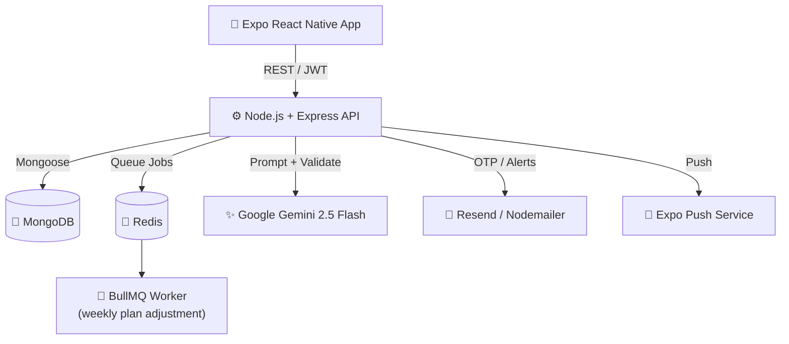

<div align="center">

# 🥗 AI Health Assistant

**Your AI-powered nutrition & fitness coach — built for Indian diets, personalized in real time.**

Generate clinically-aware, macro-perfect Indian meal plans in seconds. Track water, workouts, and daily vitals. Chat with an AI nutrition coach that actually knows your health profile.

[](#)
[](#)
[](#)
[](#)
[](#)
[](#)
[](#license)

</div>

---

## 📖 About

**AI Health Assistant** is a full-stack health & nutrition platform consisting of a **React Native (Expo) mobile app** and a **Node.js/Express API**. It uses **Google Gemini** to generate personalized, medically-aware Indian meal plans — tuned to a user's calorie and macro targets, dietary preferences, allergies, and medical conditions (diabetes, hypertension, thyroid, PCOD/PCOS, cholesterol) — and keeps those plans up to date week over week based on real logged progress.

Beyond meal planning, it's a daily companion: log meals and water, track steps and sleep, follow structured workouts, and ask an AI coach questions in a chat interface that already knows your profile and current plan.

> Built for real people managing real conditions — not just calorie counting.

---

## ✨ Features

### 🍽️ AI-Powered Nutrition
- **Personalized meal plan generation** — Gemini builds a full day (breakfast, lunch, dinner, snack) matched to exact calorie & macro targets, using realistic Indian portion sizes.
- **Medical-condition aware** — automatically adapts meals for diabetes, hypertension, thyroid, PCOD/PCOS, and high cholesterol; excludes user-declared allergens.
- **Response validation** — every AI-generated plan is schema-validated (Zod) and auto-corrected if it drifts from calorie/macro budgets, so you never see a broken or wildly inaccurate plan.
- **Weekly auto-adjustment** — a background job (BullMQ + Redis) reviews the week's actual logs and re-tunes next week's targets automatically.
- **Meal swapping** — don't like a suggested meal? Swap it for an equivalent alternative that still fits your macros.
- **AI nutrition chat** — a context-aware chat assistant that knows your health profile, current plan, and history, and gives specific, actionable advice.

### 📊 Tracking & Insights
- Daily meal logging with full nutrition history
- Water intake tracking with goals and undo support
- Steps, water, and sleep tracking with weekly summaries and trend insights
- Weekly insight reports generated from your logged data

### 💪 Workouts
- Goal-based workout plans (bulk / lean / fit) for both equipment and bodyweight training

### 🔐 Accounts & Profile
- Email/password authentication with JWT
- Google Sign-In
- OTP-based password reset (email delivery via Resend/Nodemailer)
- Editable health profile (age, weight, height, activity level, diet type, conditions, allergies)
- Push notifications (Expo push tokens) for reminders and updates

---

## 🏗️ Architecture


```mermaid
flowchart TD
    Mobile["📱 Expo React Native App"] -->|REST / JWT| API["⚙️ Node.js + Express API"]
    API -->|Mongoose| Mongo[("🍃 MongoDB")]
    API -->|Queue Jobs| Redis[("🧠 Redis")]
    Redis --> Worker["👷 BullMQ Worker\n(weekly plan adjustment)"]
    API -->|Prompt + Validate| Gemini["✨ Google Gemini 2.5 Flash"]
    API -->|OTP / Alerts| Email["📧 Resend / Nodemailer"]
    API -->|Push| Expo["🔔 Expo Push Service"]
```

**Flow in short:** the mobile app talks to the Express API over authenticated REST calls → the API reads/writes MongoDB, calls Gemini for AI meal plans and chat, and queues periodic recalculation jobs onto Redis/BullMQ, which a separate worker process picks up.

---

## 🧰 Tech Stack

| Layer | Technology |
|---|---|
| **Mobile App** | Expo (React Native 0.81, React 19), Expo Router, React Navigation |
| **Backend API** | Node.js, Express 5 |
| **Database** | MongoDB + Mongoose |
| **Queue / Jobs** | Redis + BullMQ (weekly plan adjustment worker) |
| **AI** | Google Gemini 2.5 Flash (`@google/generative-ai`), Zod for output validation |
| **Auth** | JWT, bcrypt, Google OAuth (`google-auth-library`) |
| **Email** | Resend / Nodemailer (OTP delivery) |
| **Push Notifications** | Expo Server SDK |
| **Security** | Helmet, express-rate-limit, CORS |

---

## 📁 Project Structure

```
Ai-health-Assitant-/
├── backend/                        # Express API
│   ├── server.js                   # App entry point
│   └── src/
│       ├── config/                 # MongoDB & Redis connections
│       ├── controllers/            # Auth, user, workout, tracking logic
│       ├── middleware/             # JWT auth middleware
│       ├── models/                 # User, WorkoutPlan, DailyLog schemas
│       ├── modules/
│       │   ├── health/             # Health profile module
│       │   └── nutrition/          # Meal plans, meal logging, water,
│       │                           # AI chat, weekly insights
│       ├── jobs/ & queues/         # Scheduled + queued background jobs
│       ├── workers/                # BullMQ worker process
│       ├── services/               # Gemini AI prompt/response service
│       └── utils/                  # Email, push notification helpers
│
└── mobileapp/
    └── ai-health-frontend/         # Expo React Native app
        ├── app/                    # Expo Router entry
        └── src/
            ├── screens/            # Auth, tracking, workouts, profile
            │   └── nutrition/      # Meal logging, dashboard, AI chat, water
            ├── navigation/         # Auth & main navigators
            ├── context/            # AuthContext (JWT session state)
            ├── services/           # Axios API client
            └── components/         # Shared UI components
```

---

## 🚀 Getting Started

### Prerequisites

- **Node.js** v18+
- **MongoDB** (local or Atlas)
- **Redis** (local or hosted, e.g. Upstash)
- **Expo CLI** (`npx expo`) and the **Expo Go** app, or an Android/iOS build environment
- A **Google Gemini API key**
- (Optional) Google OAuth client ID, and a Resend/SMTP account for OTP emails

### 1. Clone the repository

```bash
git clone https://github.com/amansamani/Ai-health-Assitant-.git
cd Ai-health-Assitant-
```

### 2. Backend setup

```bash
cd backend
npm install
```

Create a `.env` file inside `backend/`:

```env
# Server
PORT=5000

# Database
MONGO_URI=mongodb://localhost:27017/ai_health_assistant

# Auth
JWT_SECRET=your_jwt_secret_here
GOOGLE_WEB_CLIENT_ID=your_google_oauth_client_id

# AI
GEMINI_API_KEY=your_gemini_api_key

# Queue / Cache
REDIS_URL=redis://localhost:6379

# Email (OTP delivery — use one)
RESEND_API_KEY=your_resend_api_key
```

Start the API:

```bash
npm run dev          # start the API server (nodemon)
npm run dev:worker    # in a second terminal — start the BullMQ worker
```

The API will be live at `http://localhost:5000`. Confirm with `GET /health`.

### 3. Mobile app setup

```bash
cd mobileapp/ai-health-frontend
npm install
```

Update the API base URL in `src/services/api.js` to point at your machine's local IP (so a physical device/emulator can reach it):

```js
const API = axios.create({
  baseURL: "http://<YOUR_LOCAL_IP>:5000/api",
  timeout: 15000,
});
```

Then start Expo:

```bash
npm start
```

Scan the QR code with **Expo Go**, or run:

```bash
npm run android   # Android
npm run ios       # iOS
```

---

## 🔌 Core API Endpoints

All authenticated routes require `Authorization: Bearer <token>`.

| Method | Endpoint | Description |
|---|---|---|
| `POST` | `/api/auth/register` | Create a new account |
| `POST` | `/api/auth/login` | Log in and receive a JWT |
| `POST` | `/api/auth/google` | Google Sign-In |
| `POST` | `/api/auth/forgot-password` → `/verify-otp` → `/reset-password` | OTP-based password reset flow |
| `GET` / `POST` `/api/health` | Get or create the user's health profile |
| `POST` | `/api/nutrition/generate` | Generate a new AI meal plan |
| `GET` | `/api/nutrition/current` | Fetch the active meal plan |
| `POST` | `/api/nutrition/swap` | Swap a meal for an alternative |
| `POST` | `/api/nutrition/log-meal` | Log a consumed meal |
| `POST` | `/api/nutrition/ai-chat` | Chat with the AI nutrition coach |
| `GET` / `POST` `/api/nutrition/water` | Track water intake |
| `GET` | `/api/workouts?goal=&mode=` | Fetch workout plans by goal & mode |
| `GET` / `POST` `/api/track/today` | Get or save today's steps/water/sleep |
| `GET` | `/api/track/weekly` | Weekly activity summary |

---

## 🗺️ Roadmap

- [ ] Photo-based meal logging (snap a plate, get instant macros)
- [ ] Wearable integration (Google Fit / Apple Health)
- [ ] AI-personalized workout generation (parity with nutrition module)
- [ ] Exportable weekly PDF/CSV reports for doctors & trainers
- [ ] Multi-language support (Hindi and other regional languages)

---

## 🤝 Contributing

Contributions are welcome!

1. Fork the repository
2. Create a feature branch (`git checkout -b feature/your-feature`)
3. Commit your changes with clear messages
4. Open a pull request describing what changed and why

Please open an issue first for large changes so we can discuss direction before you invest time.

---

## 📄 License

Distributed under the **MIT License**. See `LICENSE` for details.

---

## 💬 Contact & Support

Questions, bugs, or feature ideas? Open an issue on GitHub or reach out via the maintainer's profile.

<div align="center">

**If this project helps you, consider giving it a ⭐ — it really helps!**

</div>
